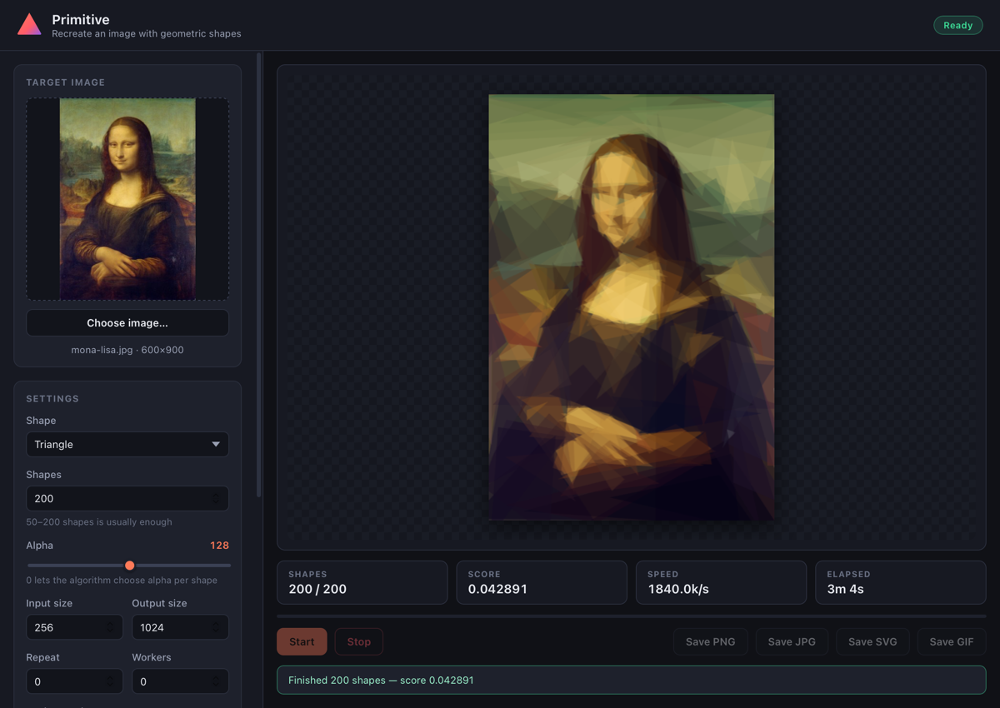
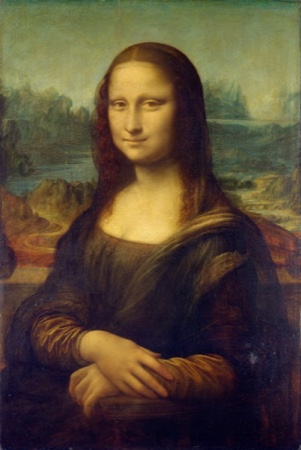
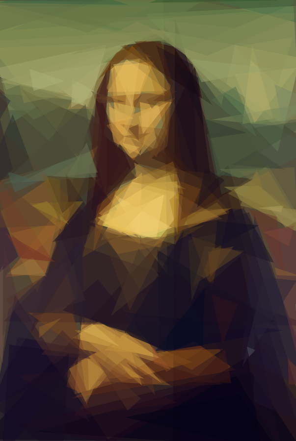
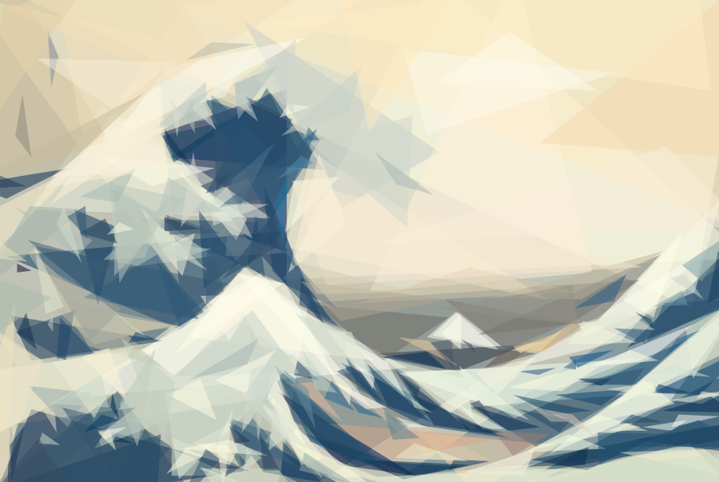

<div align="center">

# Primitive Desktop

**Reproducing images with geometric primitives — now with a native macOS app.**



<sub>Recreating the Mona Lisa with 200 triangles, live in the app.</sub>

</div>

---

**Primitive** recreates any picture using nothing but overlapping geometric shapes.

It starts from a blank canvas and repeatedly asks one question: *what single triangle, rectangle or
ellipse would reduce the error the most?* It draws that shape, then asks again. Fifty to two hundred
shapes is usually enough to produce something recognisable — and often strangely beautiful.

This repository is a fork of [Michael Fogleman's original `primitive`](https://github.com/fogleman/primitive)
with a **native desktop app** built on top of it: live preview as the picture emerges, real controls
for every parameter, animated GIF export, and HEIF/HEIC support.

## Examples

Both source images are public domain. Every result below was produced by this code.

| Source | Primitive |
|:---:|:---:|
|  |  |
| *Mona Lisa*, Leonardo da Vinci | **200 triangles** |
|  |  |
| *The Great Wave off Kanagawa*, Hokusai | **300 triangles** |

<details>
<summary>The exact commands</summary>

```bash
primitive -i mona-lisa.jpg  -o mona-lisa.png  -n 200 -m 1 -r 400 -s 900
primitive -i great-wave.jpg -o great-wave.png -n 300 -m 1 -r 400 -s 900
```

</details>

## The app

A native window — no browser, no Electron. Pick an image or drag one onto the window, press
**Start**, and watch the picture assemble itself shape by shape.

- **Live preview** — every shape is streamed to the window as it is chosen, with running score and speed.
- **Real controls** — shape type, shape count, alpha, input/output size, background colour and worker count.
- **Animated GIF export** — a built-in pure-Go encoder, so nothing extra needs installing.
- **Wide input support** — PNG, JPEG, GIF and BMP everywhere, plus **HEIF/HEIC**, AVIF, WebP,
  TIFF and several RAW formats on macOS via the system image framework.
- **Stop mid-run** without losing the result, then save as PNG, JPG, SVG or GIF.
- **Fast** — multi-core, with the image held in memory and partial re-scoring between shapes.

## Install

### Download

Grab the latest build from the [**releases page**](https://github.com/DeadLaurin/primitive-desktop/releases/latest).

| Platform | File | Notes |
| --- | --- | --- |
| macOS (Apple silicon) | `Primitive-<version>-macos-arm64.zip` | Unzip, then drag `Primitive.app` to Applications |
| Windows (x64) | `Primitive-<version>-windows-amd64.zip` | Unzip and run `Primitive.exe` |

> [!NOTE]
> The macOS build is **ad-hoc signed but not notarised**, so Gatekeeper will complain the first time.
> Right-click the app and choose **Open**, or run `xattr -dr com.apple.quarantine /Applications/Primitive.app`.

### Build from source

Requires Go 1.26+ and the [Wails v2 CLI](https://wails.io):

```bash
go install github.com/wailsapp/wails/v2/cmd/wails@latest

git clone https://github.com/DeadLaurin/primitive-desktop.git
cd primitive-desktop/desktop
wails build
open build/bin/Primitive.app
```

The command-line tool builds with nothing but Go:

```bash
go build -o bin/primitive .
./bin/primitive -i input.png -o output.png -n 100
```

## Command line

The original CLI is fully intact.

| Flag | Default | Description |
| --- | --- | --- |
| `i` | n/a | input file |
| `o` | n/a | output file |
| `n` | n/a | number of shapes |
| `m` | 1 | mode: 0=combo, 1=triangle, 2=rect, 3=ellipse, 4=circle, 5=rotatedrect, 6=beziers, 7=rotatedellipse, 8=polygon |
| `rep` | 0 | add N extra shapes each iteration with reduced search (mostly good for beziers) |
| `nth` | 1 | save every Nth frame (only when `%d` is in output path) |
| `r` | 256 | resize large input images to this size before processing |
| `s` | 1024 | output image size |
| `a` | 128 | colour alpha (use `0` to let the algorithm choose alpha per shape) |
| `bg` | avg | starting background colour (hex) |
| `j` | 0 | number of parallel workers (default uses all cores) |
| `v` / `vv` | off | verbose / very verbose output |

Small input images work best — around 256×256. The detail is thrown away anyway and everything runs faster.

## Output formats

Chosen by the output filename extension:

- **PNG** — raster
- **JPG** — raster
- **SVG** — vector, with every shape as a real SVG element
- **GIF** — animated, showing the shapes being added

For PNG and SVG you can put `%d`, `%03d` and so on in the filename to save every frame separately,
and `-o` may be given more than once to write several formats in one pass.

### About GIF

Early versions shelled out to ImageMagick, which meant GIF export silently failed for anyone who
did not have it installed. This fork ships a **pure-Go encoder** instead:

- one **global colour table** computed across every frame, so colours stay stable instead of flickering;
- frames rendered **directly at the export size**, by walking the shape history once rather than
  materialising a full-resolution image per frame — a 500-shape run at 1024 px would otherwise need
  gigabytes;
- optional Floyd–Steinberg dithering, **off by default**, because these images are made of flat
  shapes where error diffusion only adds visible grain and roughly doubles the file size.

If ImageMagick *is* installed, the app detects it at startup and offers it as an alternative encoder.
Should it fail, the built-in encoder takes over so an export always produces a file.

## Supported input formats

| | |
| --- | --- |
| **Everywhere** | PNG, JPEG, GIF, BMP |
| **macOS, additionally** | HEIF/HEIC, AVIF, WebP, TIFF, and several camera RAW formats |

The desktop app tries the Go standard library first and only falls back to the system image framework
(macOS ImageIO) when that fails, so ordinary PNG and JPEG loads never touch cgo.

## How it works

Say we have a **target image** — the picture we are trying to recreate. We start with a blank canvas
filled with a single solid colour (the average colour of the target). Call it the **current image**.
Now we begin evaluating shapes.

```
current image + candidate shape  ->  new image
RMSE(new image, target image)    ->  score
```

The score is the [root-mean-square error](https://en.wikipedia.org/wiki/Root-mean-squared_deviation)
between the two images. Shapes are generated at random, then **mutated** — nudge a triangle vertex,
tweak an ellipse radius, rotate a rectangle — and re-scored. A mutation that improves the score is
kept; one that does not is rolled back. Repeating that is [hill climbing](https://en.wikipedia.org/wiki/Hill_climbing).

Hill climbing gets stuck in local minima, so the search is restarted many times from different random
shapes, and the best result wins. This is done in parallel across all CPU cores. Once the best shape
is found it is committed to the canvas permanently, and the whole process repeats for the next shape.

A few details make it much faster than the naive version:

- **Scanline rasterisation** of every shape in pure Go, so the affected pixels are known exactly.
- **Direct colour computation** — the optimal colour for a shape is *calculated* from the pixels it
  covers rather than searched for.
- **Partial image difference** — only the pixels a shape actually touches need re-scoring.

`primitive` is not a genetic algorithm. It optimises one shape at a time, which turns out to be both
faster and better here than evolving a whole population.

More shapes can be added by implementing a small interface:

```go
type Shape interface {
	Rasterize() []Scanline
	Copy() Shape
	Mutate()
	Draw(dc *gg.Context, scale float64)
	SVG(attrs string) string
}
```

## Project layout

```
.
├── main.go              command-line entry point
├── primitive/           the algorithm: shapes, scoring, rasterisation
│   └── gif.go           pure-Go animated GIF encoder
├── desktop/             the macOS/Wails application
│   ├── app.go           methods bound to the frontend
│   ├── imagedecode_*.go HEIF/HEIC decoding via ImageIO
│   └── frontend/src/    the UI (plain HTML/CSS/JS, no bundler)
├── examples/            sample input images
└── docs/                images used in this README
```

## Tests

```bash
go test ./...                              # algorithm + GIF encoder + HEIC decoding
cd desktop && node frontend/test/ui_test.js  # the real UI script against a stub DOM
```

The Go tests cover the algorithm pipeline, GIF round-tripping (global palette, frame colours, delays),
and HEIF decoding — asserting that a decoded HEIC matches macOS's own decoder to within a mean
absolute difference of ~3.4, which is the expected loss from HEIC compression. The UI test runs the
actual `main.js` against a stub DOM and Wails bridge, checking that progress events populate every
stat, that settings are clamped before reaching Go, and that export options are forwarded correctly.

## Credits

The algorithm, the CLI and the original `primitive` package are the work of
[**Michael Fogleman**](https://github.com/fogleman) — see [fogleman/primitive](https://github.com/fogleman/primitive).
The desktop application, the pure-Go GIF encoder and the extended image decoding are additions in
this fork.

Example artwork is public domain, from Wikimedia Commons:
[*Mona Lisa*](https://commons.wikimedia.org/wiki/File:Mona_Lisa,_by_Leonardo_da_Vinci,_from_C2RMF_retouched.jpg)
and [*The Great Wave off Kanagawa*](https://commons.wikimedia.org/wiki/File:Tsunami_by_hokusai_19th_century.jpg).

The idea was originally inspired by Roger Johansson's
[Genetic Programming: Evolution of Mona Lisa](https://rogeralsing.com/2008/12/07/genetic-programming-evolution-of-mona-lisa/).

## License

MIT — see [LICENSE.md](LICENSE.md). The original copyright notice is retained.
